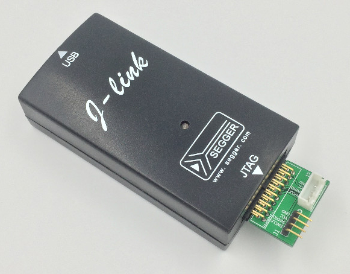
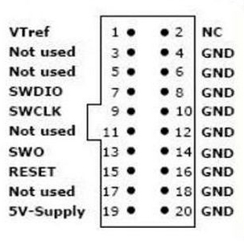
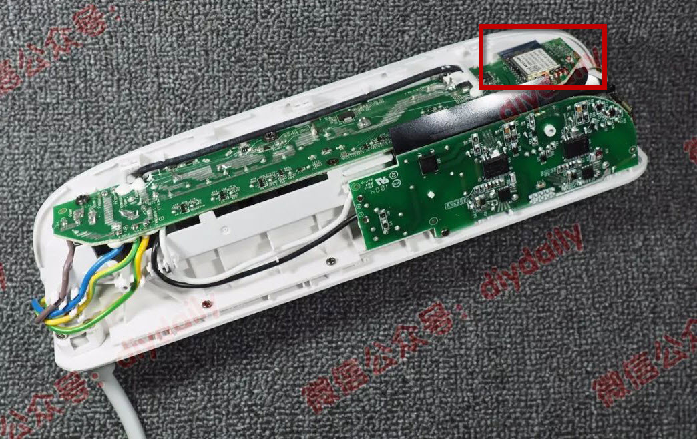
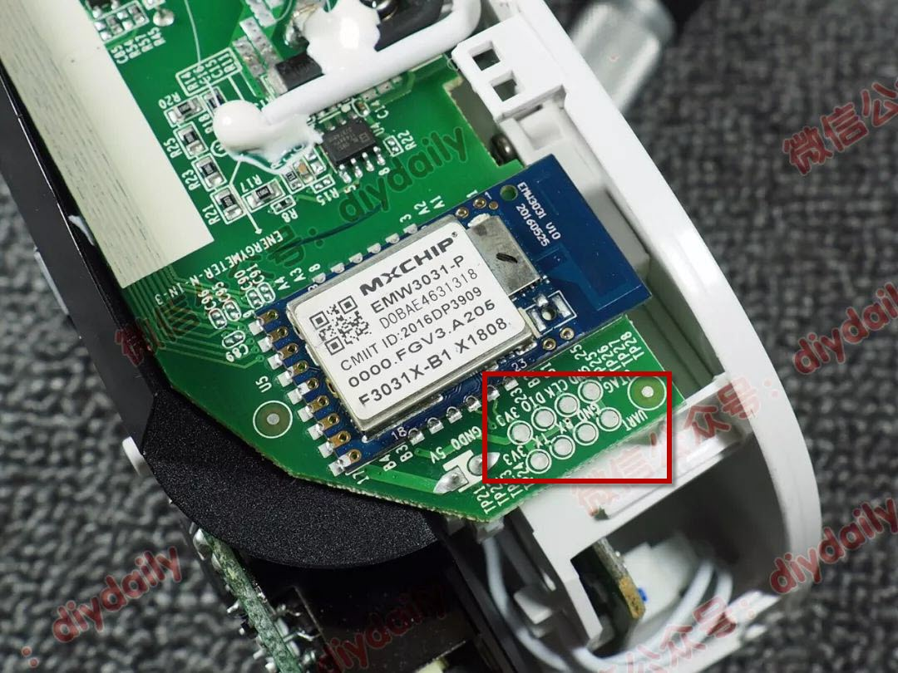
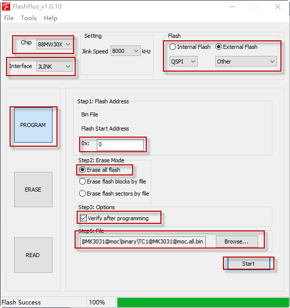

# zTC1 固件烧录

## 烧录前的准备

### 软件准备

烧录前,你需要下载好固件:即本项目release出来的bin文件

需要下载并安装软件FlashPlus

### 硬件准备

不能直接使用在线升级的方式.需要使用烧录器对TC1烧录固件,所以需要购买一个烧录器,一般为支持swd的jlink,长这样:(避免广告,我就不放链接了,一般淘宝上支持swd的jlink应该都可以,购买时卖家应该会提供驱动,在电脑上安装即可,win10可能可以自动安装驱动).图中右下角为一个jtag转swd的转接板,如果没有这个转板就需要根据下图将swdio swck两根线及gnd引出.

> 图片来自网络,侵删

#### TC1拆机与接线烧录

烧录器需要与TC1内电路板接线,需要将TC1拆开.拆开方式如下:卸掉背面垫片下2颗螺丝(螺丝可能与常用螺丝不同,需要使用对应的螺丝刀).然后就可以想帮忙直接送卡扣取下即可.

> 我的方式为将TC1倒过来放,然后在背面垫上一本厚点的书,用拳头捶书,将TC1排插部分震下来了.效果很好,卡扣都没有断裂~

拆开后的样子:(右上角红框内就是后面烧录FW需要处理的位置了)

> 文中部分图片来自微信公众号diydaily的拆机评测:https://mp.weixin.qq.com/s/8pxjWlDdObah92j2gPPImQ
>
> 已经获权使用.

如图,总共8个触点,分别为2个GND 2个3v3,clk,dio,tx,rx

我们需要使用的为dio,clk,gnd,3v3.

**gnd与jlink的gnd相连,dio与jlink的swdio相连,clk与jlink的swclk相连**,jlnk上可能没有3.3V的电源,可以直接将tc1接220V供电(注意:接220V电时不要触摸电路板,上面是有走220V电的,担心触点),或是将jlink的5V接到上图中的5v标志位置.检查下接线,没有问题就可以准备烧录了.

## 烧录

安装打开:

1. 选择Chip :88MW30X
2. 选择Interface:JLINK
3. 现在Flash为External Flash,选择QSPI,选择Otehr
4. 单击PROGRAM按钮
5. Step1:Flash Address中地址输入0
6. Step2:Erase Mode中现在Erase all flash
7. Step3: Options中,建议勾选Verify after programming
8. 单击Browse,选择之前下载好的bin文件
9. 点击start开始下载,直到有成功的提示,则烧录完成

整个过程需要点选的按钮截图如下:

### 烧录完成

烧录完成后,重新上电.确认没有问题装会壳内即可使用.

接下来就可以开始使用.

